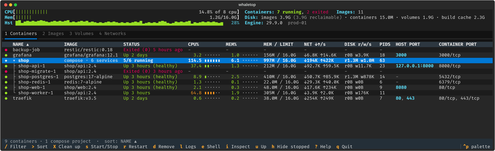
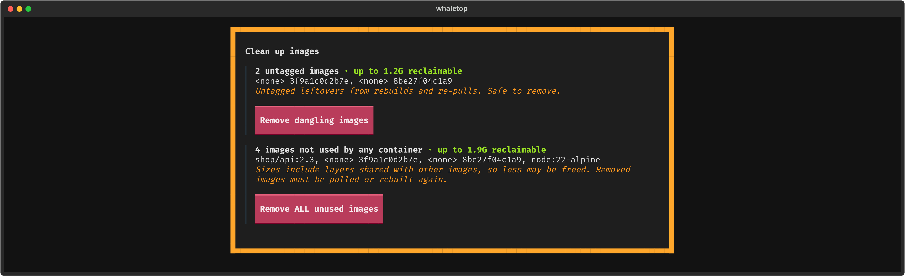
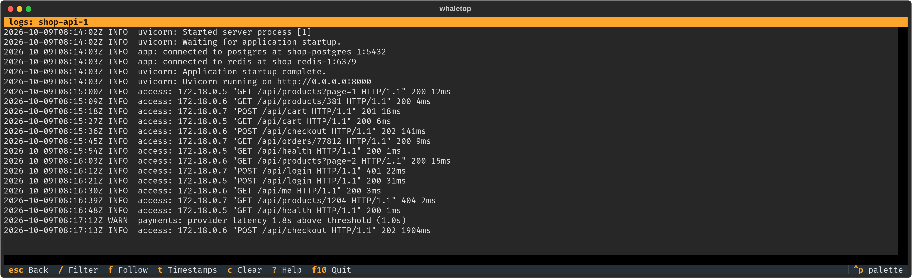

---
hide:
  - navigation
---

# whaletop

A terminal user interface for Docker in the style of `htop`. whaletop provides the container,
Compose, image, volume and network management of Docker Desktop in a keyboard-driven console
application that runs locally, over SSH and on headless servers.



## Features

<div class="grid cards" markdown>

-   :material-chart-line: **Live resource usage**

    ---

    CPU, memory, network and block I/O per container, aggregated per Compose project, with
    host-level meters and CPU history.

-   :material-layers-triple: **Compose-aware**

    ---

    Containers are grouped by Compose project. Start, stop, restart, pull, `up` and `down`
    apply to a whole stack or to a single service.

-   :material-console: **Container operations**

    ---

    Logs with filtering and follow mode, interactive shell, `attach`, inspect, pause, kill and
    remove.

-   :material-broom: **Previewed clean-up**

    ---

    Each prune operation lists the affected objects and the reclaimable space before anything
    is removed.

-   :material-server-network: **Local and remote**

    ---

    Connects to the local socket, to remote daemons over SSH, and to TLS-protected TCP
    endpoints.

-   :material-lightning-bolt: **Event-driven**

    ---

    Views update from the Docker event stream. No manual refresh is required.

</div>

## Quick start

=== "Debian / Ubuntu"

    ```sh
    curl -fsSL https://open-package.github.io/whaletop/whaletop.gpg \
      | sudo tee /usr/share/keyrings/whaletop.gpg >/dev/null
    echo "deb [signed-by=/usr/share/keyrings/whaletop.gpg] https://open-package.github.io/whaletop stable main" \
      | sudo tee /etc/apt/sources.list.d/whaletop.list
    sudo apt update && sudo apt install whaletop
    ```

=== "pipx"

    ```sh
    pipx install whaletop
    ```

=== "uv"

    ```sh
    uv tool install whaletop
    ```

Then start it:

```sh
whaletop
```

Continue with the [installation guide](install.md) for requirements and remote hosts, or with
the [usage guide](usage.md) for the full key reference.

## More views




